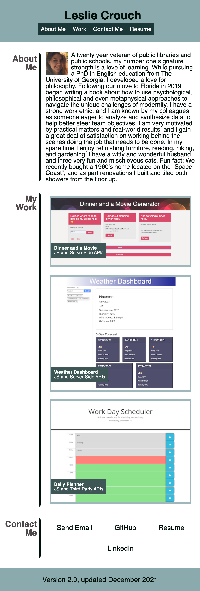

# Updated Portfolio

[Click here to view my updated and deployed portfolio.](https://tripledawg.github.io/updated-portfolio/)

## Description   

I have updated my portfolio to have a more modern layout, and the content now features my top three work samples so far. I have updated and modernized the look of the page from the first page using css border boxes and media queries in addition to flex boxes. I also used the coolors webpage to help find a unique but also complementary color scheme. 

The content now features a group project and the two most recent homework assignments.  For the  group project called Dinner and a Movie [link](https://github.com/hak9292/dinner-and-a-movie) I designed the UI and programmed the API call that converted zipcodes to latitude and longitude coordinates.  The other two works samples, Weather Dashboard [link](https://github.com/tripledawg/weather-dashboard-using-server-side-APIs) and Work Day Scheduler [link](https://github.com/tripledawg/05-Third-Party-APIs-Work-Day-Scheduler) involve using JS to communicate with third party and server-side
APIs. 
  
I also updated my GitHub account with a recent photo and pinned repositories.

## Technologies Used

Homepage: CSS, HTML, Google Fonts, 

Linked Work: CSS, Bootstrap, HTML, JS, JQuery, Open Weather API, MomentJS

